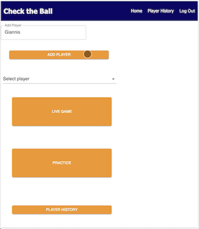
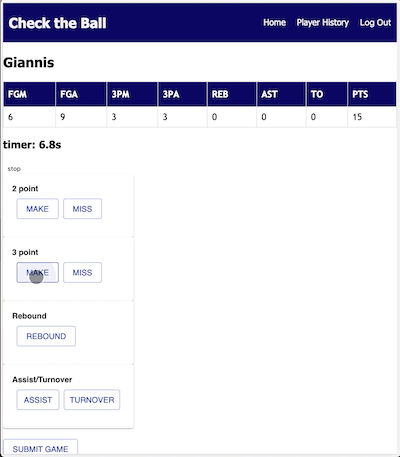

# Check the Ball
Check the Ball is an app that allows the user to track and record their basketball statistics such as points, rebounds, and assists. The app provides a way for players to keep a history of their stats which provides users insight on which areas of their game they can improve on.


## Prerequisites

Before you get started, make sure you have the following software installed on your computer:

- [Node.js](https://nodejs.org/en/)
- [PostrgeSQL](https://www.postgresql.org/)
- [Nodemon](https://nodemon.io/)

## Create database and table

Create a new database called `prime_app` and create a `person` table:

```SQL
CREATE TABLE "person" (
    "id" SERIAL PRIMARY KEY,
    "username" VARCHAR (80) UNIQUE NOT NULL,
    "password" VARCHAR (1000) NOT NULL
);

CREATE TABLE "player" (
"id" SERIAL PRIMARY KEY,
"player_name" VARCHAR (80) NOT NULL,
"person_id" INT REFERENCES "person"
);

CREATE TABLE "box_score" (
"id" SERIAL PRIMARY KEY,
 "date" DATE NOT NULL DEFAULT CURRENT_DATE, "FGA" INT DEFAULT 0,"FGM" INT DEFAULT 0, 
 "3PA" INT DEFAULT 0, "3PM" INT DEFAULT 0, "REB" INT DEFAULT 0, "AST" INT DEFAULT 0, 
 "TO" INT DEFAULT 0, "PTS" INT DEFAULT 0, "game_mode" VARCHAR (15) NOT NULL, 
 "player_id" INT REFERENCES "player");

```
## Features

* Home screen allows you to add and select players
* User can select practice, live game, or player history from screen



* Live game/Practice screen displays players boxscore at the top of the screen
* As the player scores or records a stat, the user can log the stat by clicking on the respective stat button]
* Clicking "Submit Game" will record the game session allowing the user to access that boxscore in the "Player History" page



